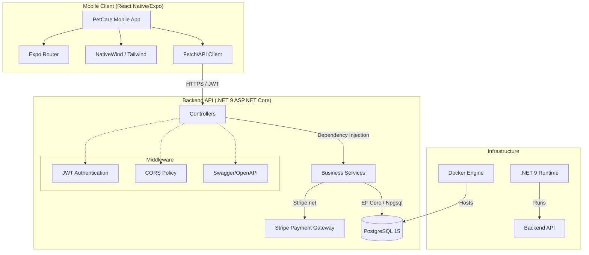

# PetCare Services - Architecture Documentation

## System Architecture Diagram

## Component Breakdown

### 1. Frontend (Mobile Application)
- **Framework**: React Native 0.81.4 (React 19.1.0)
- **Platform**: Expo 54.0.13
- **Navigation**: Expo Router (File-based routing)
- **Styling**: NativeWind (Tailwind CSS for React Native)
- **Icons**: Lucide-react-native
- **State Management**: React Hooks & Context API

### 2. Backend (RESTful API)
- **Framework**: ASP.NET Core 9.0
- **Language**: C# 13
- **ORM**: Entity Framework Core (Code-first)
- **Authentication**: JWT Bearer Tokens
- **Documentation**: Swagger/OpenAPI (Swashbuckle)
- **Logging**: Serilog

### 3. Database Layer
- **Engine**: PostgreSQL 15+
- **Driver**: Npgsql
- **Schema**: Relational with Foreign Key constraints
- **Integrity**: Strong ACID compliance for appointments and payments

### 4. External Integrations
- **Payments**: Stripe API via `Stripe.net`
- **Containerization**: Docker & Docker Compose for database management

## Data Flow
1. **User Request**: The user interacts with the React Native app.
2. **API Call**: The app makes an asynchronous fetch request with a JWT token to the .NET 9 API.
3. **Authentication**: Middleware validates the JWT and authorizes the request.
4. **Business Logic**: Controllers invoke services to process logic (e.g., booking an appointment).
5. **Persistence**: Services use EF Core to interact with the PostgreSQL database.
6. **Response**: The API returns a structured JSON response back to the mobile client.
